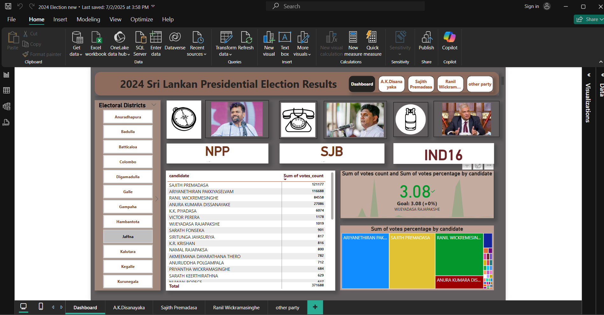
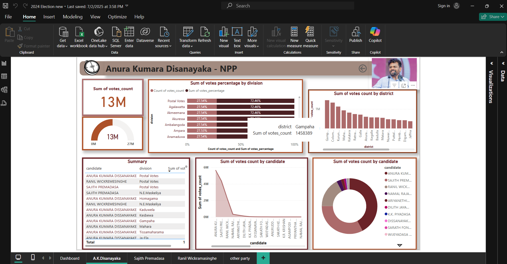
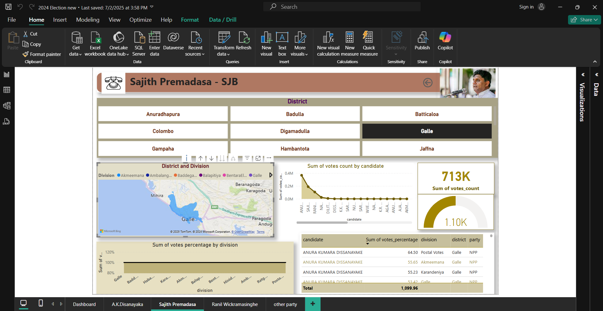
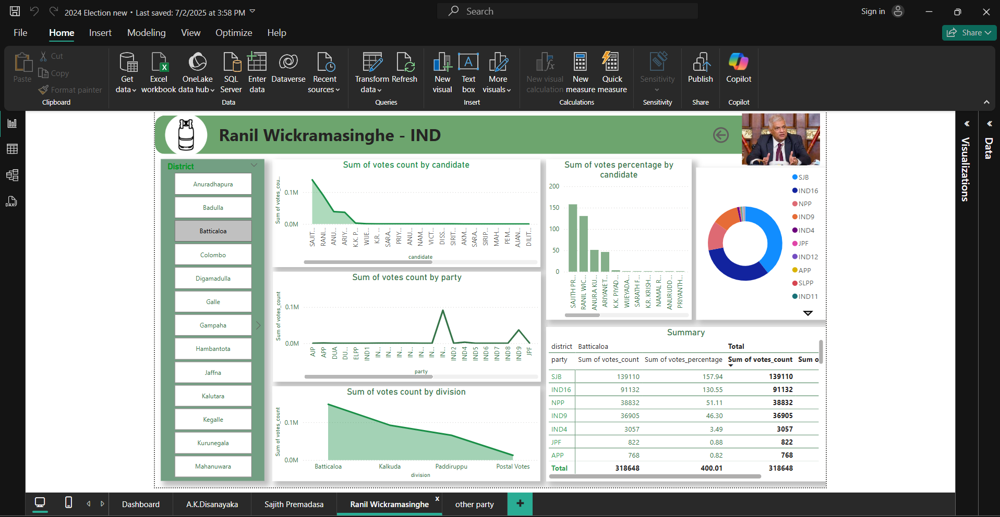
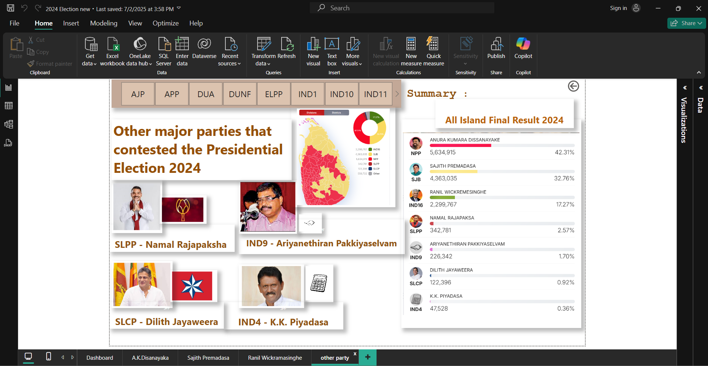

# 2024 Election Data Analysis Sri Lanka
This Power BI project presents an analysis of the 2024 Sri Lankan election data.

## 📊 Features
- Visualized vote distributions by province/district
- Voter turnout trends
- Party-wise comparisons

## 📊 Report Overview

The Power BI report consists of **five interactive pages**:

1. 👤 **Dashboard**  
   A summary of the overall election results, trends, and key metrics.

2. 👤 **A.K. Dissanayake**  
   Candidate-specific analysis of vote share, regional strength, and public impact.

3. 👤 **Sajith Premadasa**  
   Insights into campaign performance, votes by province, and demographic support.

4. 👤 **Ranil Wickremesinghe**  
   Analysis of his vote patterns, support base, and political influence.

5. 👤 **Other Parties**  
   A comparative look at other candidates, emerging parties, and their vote shares.

## 📁 Files
- `2024 Election new.pbix` — Main Power BI file
- `Screenshot 2025-07-04 103146.png` — Screenshot of the main dashboard
- `Screenshot 2025-07-04 103238.png` — Screenshot of the Anura Kumara Disanayaka Results dashboard
- `Screenshot 2025-07-04 103318.png` — Screenshot of the Sajith Premadasa Results dashboard
- `Screenshot 2025-07-04 103335.png` — Screenshot of the Ranil Wickramasinghe Results dashboard
- `Screenshot 2025-07-04 103359.png` — Screenshot of the Other Parties Results dashboard
- `2024 president election result.xlsx` — Source data

## 🛠️ Tools & Technologies

| Tool        | Purpose                         |
|-------------|---------------------------------|
| Power BI    | Data visualization & reporting  |
| Kaggle.com  | Dataset source                  |

## 🚀 How to Use
1. Download the `2024 election result.pbix` file
2. Open in Power BI Desktop
3. Refresh data or modify visuals as needed

## 📌 Insights
This dashboard helps users understand voting patterns, turnout rates, and political trends of the 2024 election.

## 📷 Dashboard Preview

## 💡 Purpose & Learning Outcome

The main goal of this project is to:
- Make election data more accessible and easy to explore
- Demonstrate how **Business Intelligence (BI)** tools like Power BI can be used in real-world scenarios
- Provide meaningful insights for researchers, analysts, and the general public
- Develop and improve my skills as a future **Data/Business Analyst**

## 📈 Dataset

- **Source**: [Kaggle.com](https://www.kaggle.com/)  
- Includes candidate vote counts, district-wise data, and demographic breakdowns.

## 🔓 License

This project is for educational and non-commercial purposes.  
Please credit the original author if you use or share this work.

